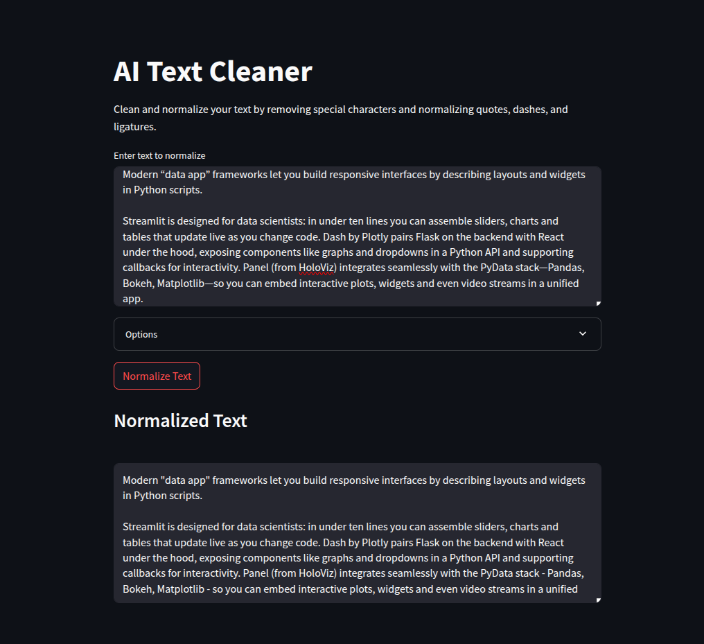

# AI Text Cleaner

## Chrome Extension

To load this tool as a Chrome Extension:

1.  Open Google Chrome.
2.  Navigate to `chrome://extensions` in your address bar.
3.  Ensure that "Developer mode" is enabled. You'll usually find a toggle switch for this in the top-right corner of the extensions page.
4.  Click the "Load unpacked" button. This will typically appear on the top-left of the page after enabling Developer mode.
5.  A file dialog will open. Navigate to and select the directory containing the extension's files (this is the directory where `manifest.json`, `popup.html`, `normalize.js`, `popup.js`, and the `images` folder are located).
6.  The "AI Code Cleaner" extension should now appear in your list of extensions and be ready to use from your Chrome toolbar.

---

A simple UI, CLI and Python script to normalize text, often useful as a preprocessing step for AI models or text analysis tasks. It cleans up common typographic inconsistencies.



## Features

The script performs the following normalization steps:

1. **Replace Dashes:** Converts em-dash (—, U+2014), en-dash (–, U+2013), non-breaking hyphen (-, U+2011), and mathematical minus (−, U+2212) to standard hyphens (-).
2. **Normalize Quotes:** Converts curly double quotes (“ ”, U+201C/U+201D) and angle double quotes (« » U+00AB/U+00BB) to straight double quotes ("). Converts curly single quotes (‘ ’, U+2018/U+2019) and angle single quotes (‹ › U+2039/U+203A) to straight single quotes (').
3. **Strip Special Spaces:** Removes non-breaking spaces (U+00A0), narrow non-breaking spaces (U+202F), and zero-width spaces (U+200B).
4. **Replace Ellipsis:** Converts single-character ellipsis (…, U+2026) to three periods (...).
5. **Replace Ligatures:** Replaces fi (fi, U+FB01) → 'fi', fl (fl, U+FB02) → 'fl', ff (ff, U+FB00) → 'ff', ffi (ffi, U+FB03) → 'ffi', ffl (ffl, U+FB04) → 'ffl'.
6. **Replace Soft Hyphens:** Removes soft hyphens (U+00AD).
7. **Replace Bullets:** Converts bullets (•, U+2022) to hyphens (-).
8. **(Optional)** Collapses multiple whitespace characters into a single space (currently commented out in the code).

## Requirements

- Python 3

No external libraries are required.

## Usage

### Web UI

Use Docker Compose to build and run services:

```bash
docker-compose up --build
```

Then, access the app at `http://localhost:8501`.

### Command Line Interface

The script can read text from a file specified as a command-line argument or from standard input. The normalized text is always written to standard output.

**1. From a file:**

```bash
python main.py input.txt > output.txt
```

Replace `input.txt` with the path to your text file. The normalized output will be saved to `output.txt`.

**2. From standard input (e.g., piping):**

```bash
cat input.txt | python main.py > output.txt
```

Or type directly into the terminal (press Ctrl+D to signal end-of-input):

```bash
python main.py
<Paste or type your text here>
^D
<Normalized text will be printed here>
```

## Building an Executable

You can generate a standalone executable using PyInstaller via the `uvx` wrapper. This places the built binary in your local bin directory:

```bash
uvx pyinstaller normalize.py \
  --onefile \
  --name normalize \
  --distpath ~/.local/bin
```

After building, ensure `~/.local/bin` is in your `PATH` to run `normalize` directly from the command line.

## License

This project does not currently have a license. Consider adding one if distributing.
